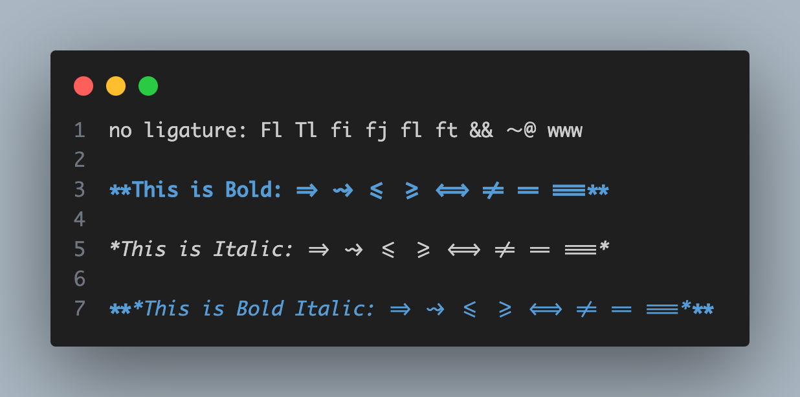
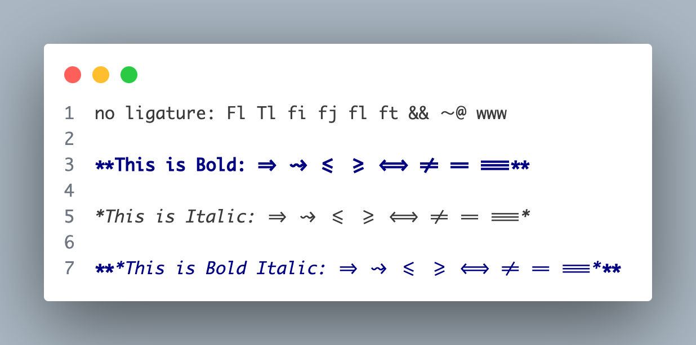
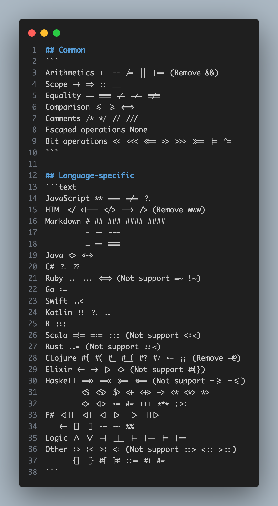
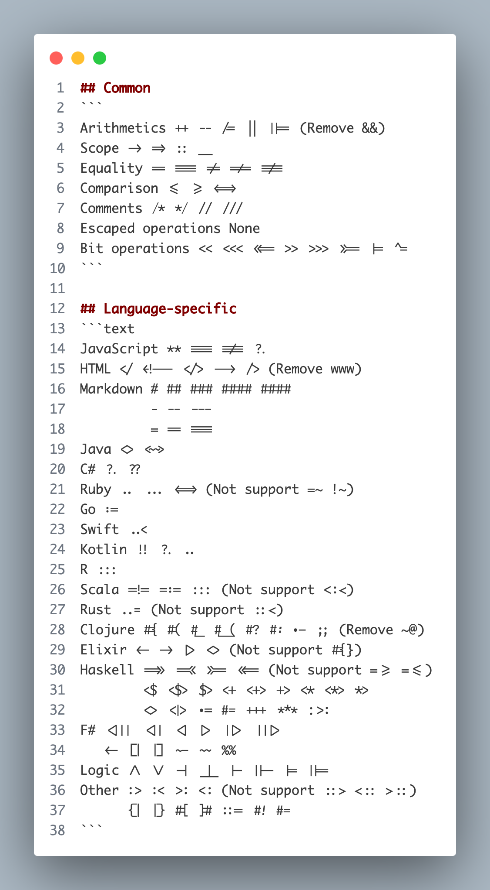

# Monaco-nerd-font-liga
This is a fork of the [Monaco Nerd Font](https://github.com/thep0y/monaco-nerd-font), with some modifications.

## Description
This version is a customized release based on the original Monaco Nerd Font. The original font can be found [here](https://github.com/thep0y/monaco-nerd-font/tree/main/original). In this modified version, the ligatures for `&&` `~@` and `www` have been removed and the missing Nerd icons from the original fork have been fixed.

## Changes
- Removed ligatures for `&&` `~@` and `www`
- Fixed missing Nerd icons from the original fork version
- All other features and symbols from the original font remain intact.

## Usage
```shell
git clone https://github.com/RooobinYe/Monaco-Nerd-Font-Liga.git

## Usage
```shell
git clone https://github.com/RooobinYe/Monaco-Nerd-Font-Liga.git
```
Download the appropriate font file and install it on your system. You can use it in any terminal or code editor that supports custom fonts.

The name of the font in the font selection menu is `Liga Monaco` and `LigeMonaco Nerd Font`.

## Screenshots
Some Ligatures:




All Ligatures:




The complete list of ligatures supported by this font can be found in the [test.md](assets/test.md) file.

## Related Projects and Acknowledgements
- [monaco-nerd-font ](https://github.com/thep0y/monaco-nerd-font)
- [Nerd Fonts](https://github.com/ryanoasis/nerd-fonts)
- [Ligaturizer](https://github.com/ToxicFrog/Ligaturizer)